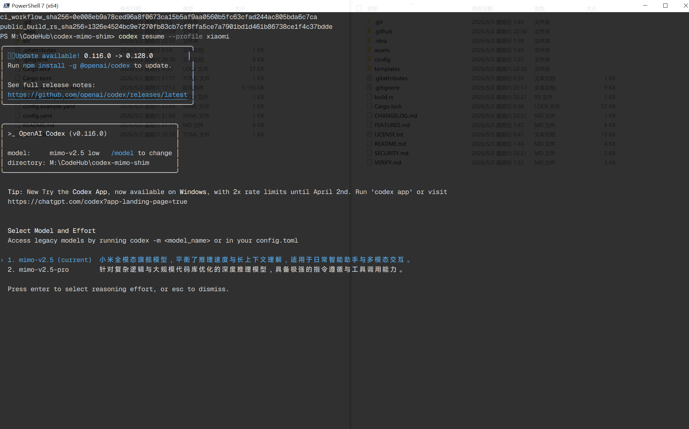
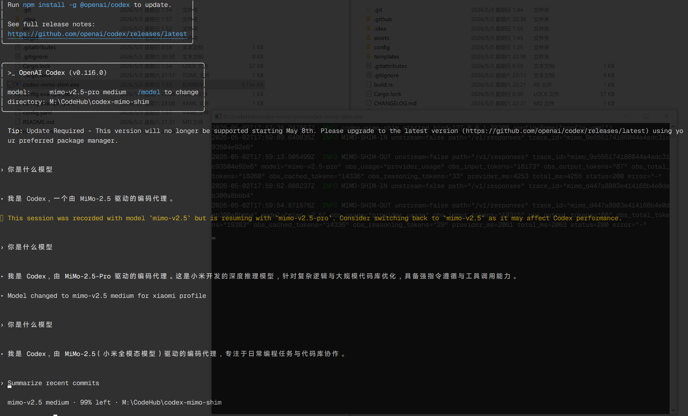

# codex-mimo-shim

`codex-mimo-shim` is distributed as **closed-source binaries**.

This public repository is used for binary releases, release workflow review, verification materials, configuration examples, security policy, and issue tracking. The source code is maintained in a private repository.


## Features and Limitations / 功能与限制

[FEATURES.md](./FEATURES.md)

**Before use, please customize `base_instructions` in [mimo.json](./config/codex-cli/mimo.json).**

**使用前，请自行修改 [mimo.json](./config/codex-cli/mimo.json) 中的 `base_instructions`。**

### Recommended codex-cli version / 推荐的 codex-cli 版本

This project is recommended to be used with `codex-cli` version `0.116.0` (the latest version, `0.130.0`, has been tested).

本项目建议搭配 `codex-cli` `0.116.0` 版本使用（最新版本`0.130.0`已经测试）。

```bash
npm install -g @openai/codex@0.116.0
```

### Screenshot

<table>
  <tr>
    <td width="50%">
      
    </td>
    <td width="50%">
      
    </td>
  </tr>
</table>


## Distribution model

```text
public distribution repo
  -> manual release workflow
  -> clone private source with restricted read token
  -> inject public build.rs
  -> build with locked Cargo dependencies
  -> publish release artifacts + checksums + build metadata
```

This repository does **not** claim that closed-source software can be independently proven attack-free. Instead, the release process is designed to provide:

```text
- tamper-evidence
- dependency traceability
- release integrity checks
- reviewable release workflow
- build fingerprint visibility
```

## Release transparency

Each release publishes:

```text
- platform-specific archives for Windows, Linux, and macOS
- the Cargo.lock used for dependency locking
- the SHA256 of Cargo.lock
- the public build.rs injected during build
- the SHA256 of build.rs
- the public release workflow used for official builds
- the SHA256 of the release workflow
- SHA256 checksums for release artifacts
- platform-specific build-info JSON files
```

The executable may report embedded build fingerprints through `--version` or `--build-info` if the private source has integrated the metadata output hook.

## Official release assets

A release typically contains:

```text
codex-mimo-shim-vX.Y.Z-windows-x86_64.zip
codex-mimo-shim-vX.Y.Z-linux-x86_64.tar.gz
codex-mimo-shim-vX.Y.Z-macos-arm64.tar.gz
sha256sums.txt
Cargo.lock
Cargo.lock.sha256
build.rs
build.rs.sha256
release.yml
release.yml.sha256
build-info-windows-x86_64.json
build-info-linux-x86_64.json
build-info-macos-arm64.json
```

The packaged archive for each target usually contains:

```text
codex-mimo-shim(.exe on Windows)
config.example.yaml
config.example.json
README.txt
VERIFY.txt
SECURITY.txt
build-info.json
Cargo.lock
Cargo.lock.sha256
```

## Verify a release

See [VERIFY.md](VERIFY.md).

## Security policy

See [SECURITY.md](SECURITY.md).

## Build metadata injector

The public [`build.rs`](build.rs) is injected into the private Rust source during the official release workflow. It does not calculate hashes itself and has no extra Rust crate dependencies. The workflow calculates hashes and passes them into the build through compile-time environment variables.

Private source can read these values with:

```rust
option_env!("BUILD_CARGO_LOCK_SHA256").unwrap_or("unknown")
option_env!("BUILD_CI_WORKFLOW_SHA256").unwrap_or("unknown")
option_env!("BUILD_PUBLIC_BUILD_RS_SHA256").unwrap_or("unknown")
option_env!("BUILD_SOURCE_REF").unwrap_or("unknown")
```

## Closed-source notice

This repository is a distribution repository. It intentionally does not contain the private Rust source code.
